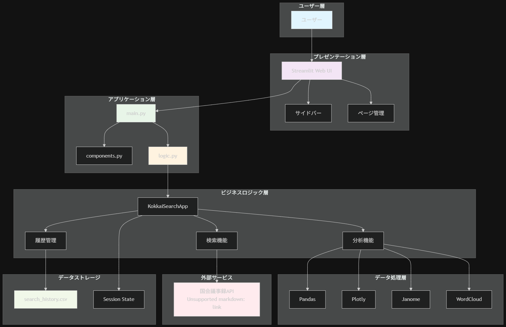
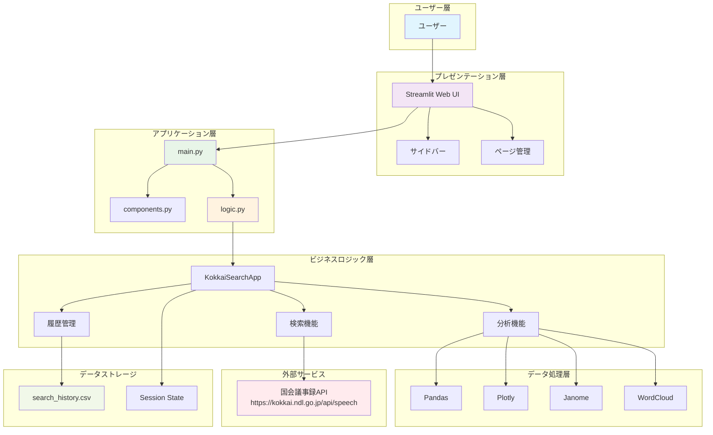
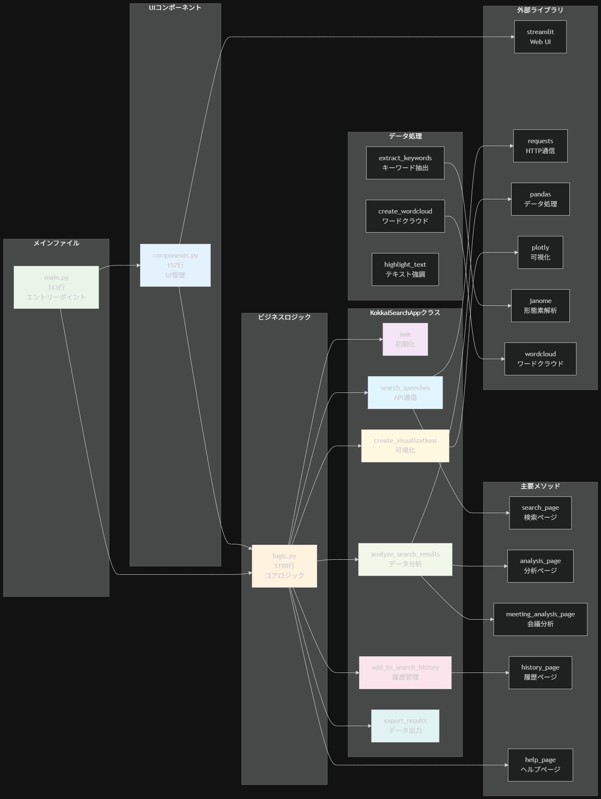
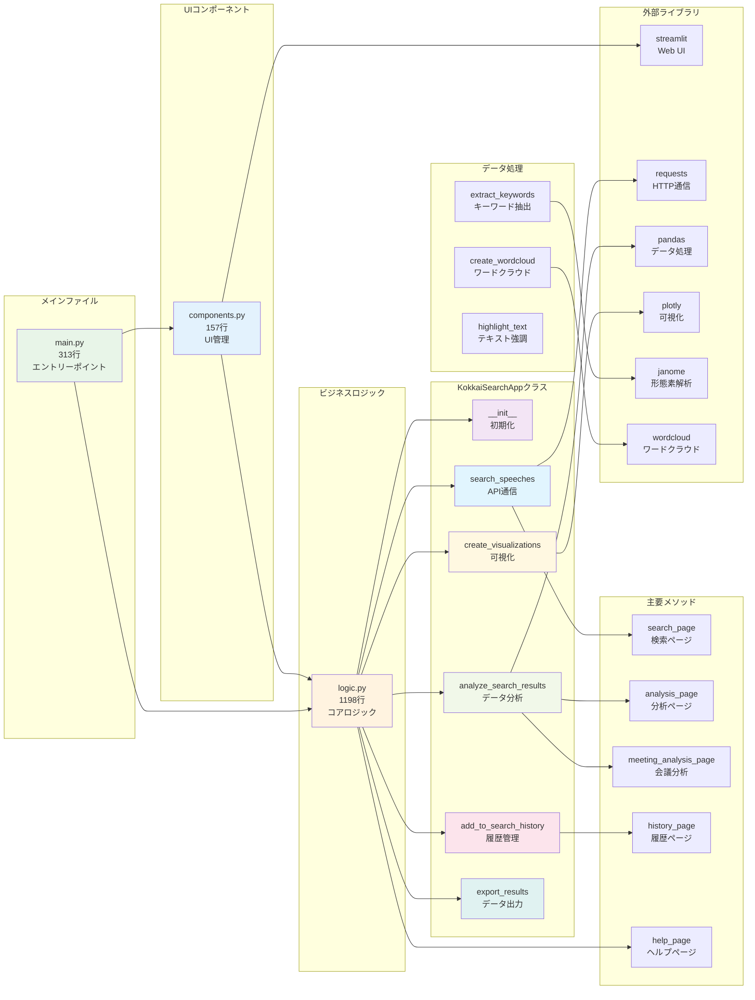

# 国会議事録検索・分析アプリケーション

## 📋 アプリケーション概要

このアプリケーションは、国会議事録APIを活用した検索・分析ツールです。ユーザーはキーワード、期間、発言者などの条件を指定して国会議事録を検索し、結果を分析・可視化することができます。

### 主要機能
- 🔍 **高度な検索機能**: キーワード、期間、発言者による検索
- 📊 **統計分析**: 発言者別・会議別・日付別の統計
- 🏛️ **キーワード分析**: 形態素解析によるキーワード抽出とワードクラウド生成
- 📚 **検索履歴管理**: CSVファイルによる履歴保存
- 📈 **データ可視化**: インタラクティブなグラフとチャート

### 使用しているAPI
- **国会議事録API**: https://kokkai.ndl.go.jp/api/speech
  - APIキー不要の公開API
  - JSON形式で議事録データを取得
  - 検索パラメータ: keyword, from, until, speaker, meeting

## 🏗️ システム設計図





## 📁 コード説明図





## 🚀 セットアップと実行

### 必要な環境
- Python 3.8+
- Anaconda（推奨）

### インストール手順
```bash
# 依存関係のインストール
pip install -r requirements.txt

# アプリケーションの起動
streamlit run main.py
```

### オプション機能の有効化
```bash
# 形態素解析機能（キーワード分析）
pip install janome

# ワードクラウド機能
pip install wordcloud matplotlib
```

## 📊 機能詳細

### 検索機能
- キーワード検索
- 期間指定（開始日〜終了日）
- 発言者名指定
- 会議名指定
- 最大取得件数設定

### 分析機能
- 発言者別統計
- 会議別統計
- 日付別統計
- キーワード頻度分析
- ワードクラウド生成

### データ管理
- 検索履歴の自動保存
- CSV形式での履歴エクスポート
- セッション状態の管理

## 🔧 技術仕様

### アーキテクチャ
- **フロントエンド**: Streamlit
- **バックエンド**: Python
- **データ処理**: Pandas, NumPy
- **可視化**: Plotly
- **自然言語処理**: Janome（オプション）
- **データストレージ**: CSVファイル

### パフォーマンス
- 検索実行: 5秒以内
- ページ表示: 2秒以内
- グラフ生成: 3秒以内

## 📝 開発情報

- **課題**: Streamlitを使ったアプリの開発 + 公開
- **学籍番号**: 22060015
- **作成日**: 2025年8月
- **バージョン**: 1.1.0

## 🔗 関連リンク

- **国会議事録API**: https://kokkai.ndl.go.jp/api/speech
- **Streamlit**: https://diet-record-search-and-analysis.streamlit.app/
